# STAC-Manager 📡 📄 — WIDGETS

- [STAC-Manager 📡 📄 — WIDGETS](#stac-manager----widgets)
  - [Existent widgets](#existent-widgets)
    - [text](#text)
    - [number](#number)
    - [radio](#radio)
    - [checkbox](#checkbox)
    - [array](#array)
    - [array:string](#arraystring)
    - [select](#select)
    - [tagger](#tagger)
    - [object](#object)
    - [json](#json)
  - [Creating a new widget](#creating-a-new-widget)

The app will render a default widget for each field type, but this can be changed by adding a `ui:widget` property to the field.

There are different widgets for different field types. The existent widgets can be found in [data-widgets/config](/packages/data-widgets/lib/config/index.ts) and the [WidgetRenderer](/packages/data-core/lib/components/widget-renderer.tsx) is the component responsible for rendering the widgets based on the field type and associated conditions.

## Existent widgets

Below is a list of the default widgets and the field types they are used for.

### text
[Source](/packages/data-widgets/lib/widgets/text.tsx) :: Default for `string` fields.

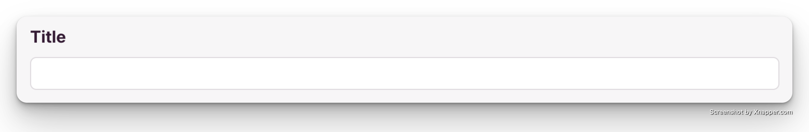

### number
[Source](/packages/data-widgets/lib/widgets/number.tsx) :: Default for `number` fields. Has the same appearance as a text widget but with a different data type.

### radio
[Source](/packages/data-widgets/lib/widgets/radio.tsx) :: Default for `string` fields with an `enum` property.

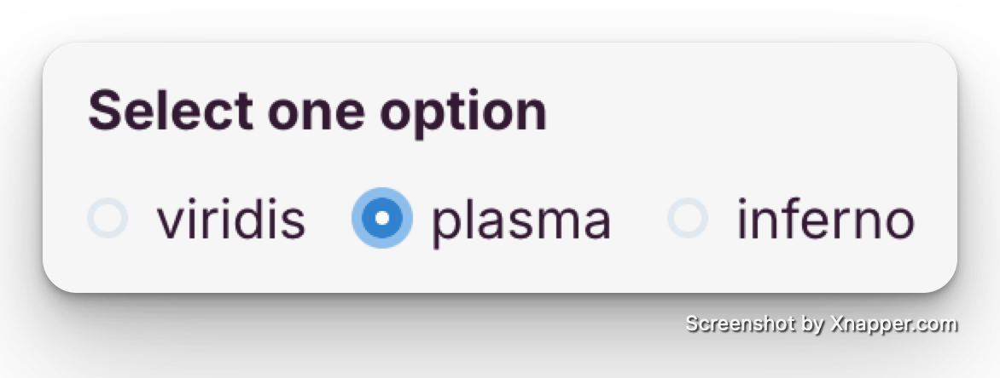

### checkbox
[Source](/packages/data-widgets/lib/widgets/checkbox.tsx) :: Default for `array` fields of `string` items with an `enum` property.


### array 
[Source](/packages/data-widgets/lib/widgets/array.tsx) :: Default for `array` fields.  
This widget doesn't render any input field, but works in tandem with the type defined in its `items` object to render the correct widget for each one.

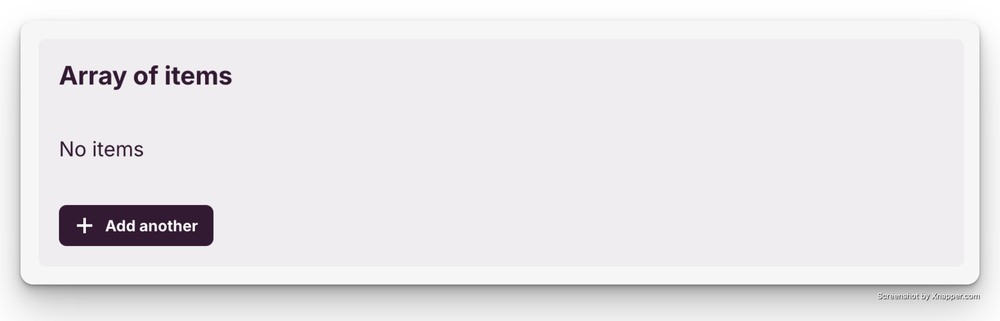

### array:string
[Source](/packages/data-widgets/lib/widgets/array-input.tsx) :: Default for `array` fields of `string` items.  
This widget is an special case of the `array` widget, where the `items` object is of type `string`.

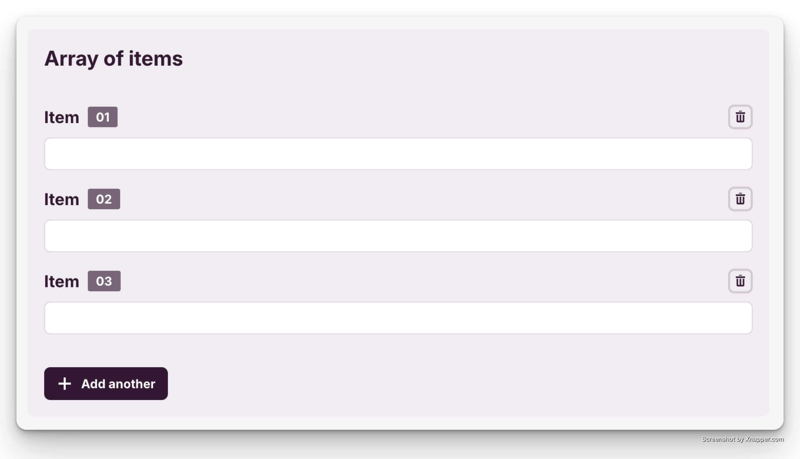

### select
[Source](/packages/data-widgets/lib/widgets/array-input.tsx)  

The `select` widget can be used for `string` fields with an `enum` property to select a single value from a list.

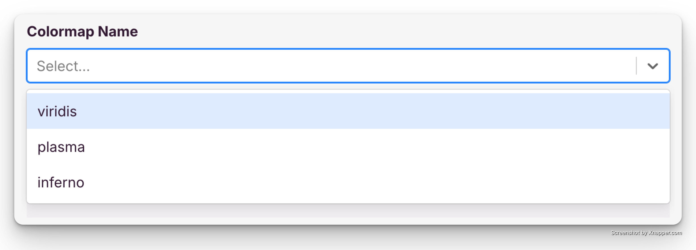

Or with an `array` fields of `string` items with an `enum` property to select multiple values from a list.

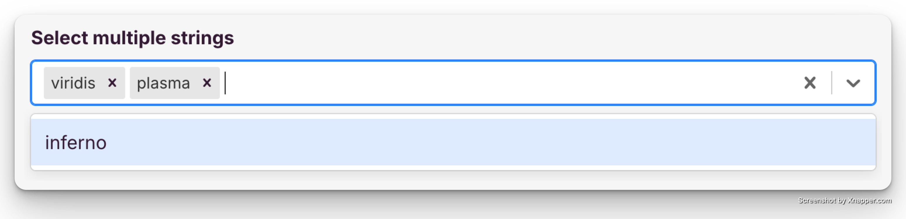

### tagger
[Source](/packages/data-widgets/lib/widgets/tagger.tsx)  
The `tagger` widget render a select like input that allows the user to select an option from the list or add a new one.

It can be used for `string` fields with an `enum` property:
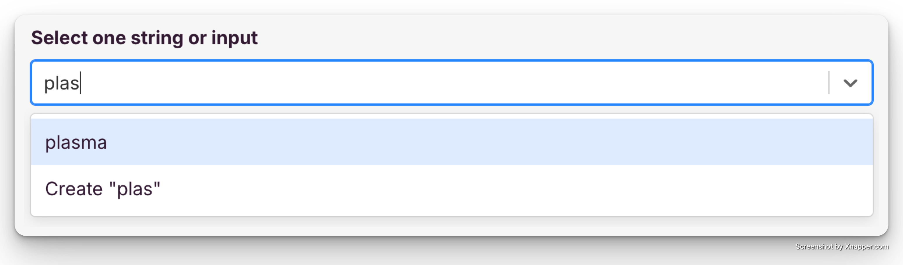

Or with `array` fields of `string` items where it allows the user to add multiple strings without the need of multiple inputs like with the `array:string` widget.
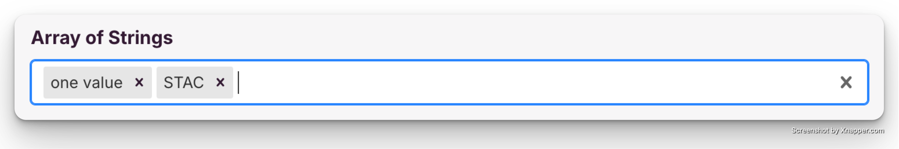

Or event with `array` fields of `string` items with an `enum` property:
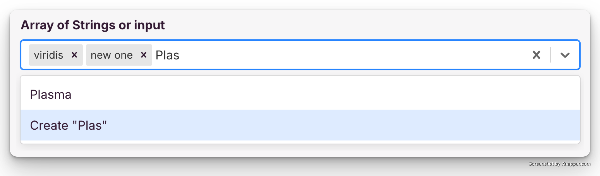

### object
[Source](/packages/data-widgets/lib/widgets/object.tsx) :: Default for `object` fields.  
Much like the `array` widget, this one doesn't render any input field. It groups the fields defined in its `properties` object while allowing the user to add new properties if enabled.

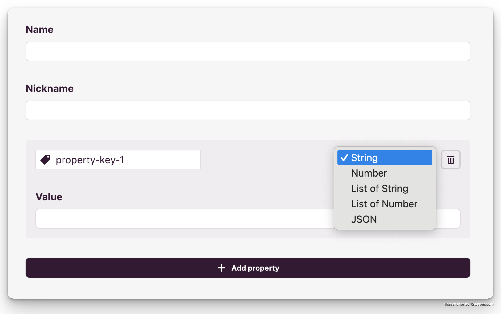
_Image show the object widget with the `additionalProperties` enabled and two string fields as properties._

### json
[Source](/packages/data-widgets/lib/widgets/json.tsx)  
Renders a JSON editor for any data type. Provides some basic validation, formatting, and undo/redo functionality.

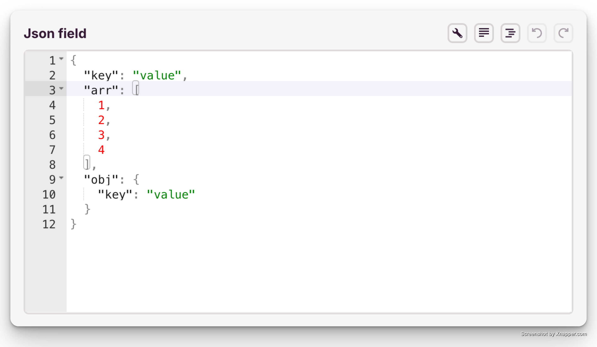

## Creating a new widget

The widgets are powered by [Formik](https://formik.org/) so it is important to get familiar with it before creating a new widget.
Although not mandatory, it is recommended to use [Chakra UI v2](https://v2.chakra-ui.com/) for the UI components.

In essence a widget is a React component that receives the following props:
- `pointer` - The field name which is used by Formik to identify the field.
- `field` - The field object from the schema.
- `isRequired` - Whether the field is required or not.

The form related props are available through the Formik methods. To ensure good performance it is recommended to use Formik's `FastField` component to wrap the widget.

Example of a simple widget for a `string` field:
```tsx
import React from 'react';
import {
  FormControl,
  FormErrorMessage,
  FormLabel,
  Input
} from '@chakra-ui/react';
import { FastField, FastFieldProps } from 'formik';
import { SchemaFieldString, WidgetProps } from '@stac-manager/data-core';

export function WidgetInput(props: WidgetProps) {
  const { pointer, isRequired } = props;
  const field = props.field as SchemaFieldString;

  return (
    <FastField name={pointer}>
      {({
        field: { value, onBlur },
        meta,
        form: { setFieldValue }
      }: FastFieldProps) => (
        <FormControl
          isRequired={isRequired}
          isInvalid={!!(meta.touched && meta.error)}
        >
          <FormLabel>{field.label}</FormLabel>
          <Input
            type='text'
            name={pointer}
            value={value === null ? '' : value}
            onBlur={onBlur}
            onChange={(e) => {
              setFieldValue(pointer, e.target.value);
            }}
          />
          <FormErrorMessage>{meta.error}</FormErrorMessage>
        </FormControl>
      )}
    </FastField>
  );
}
```

After the widget is created it should be added to the plugin configuration. See [README](./README.md) for the config details.
